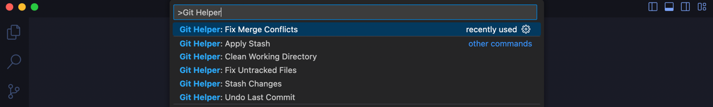
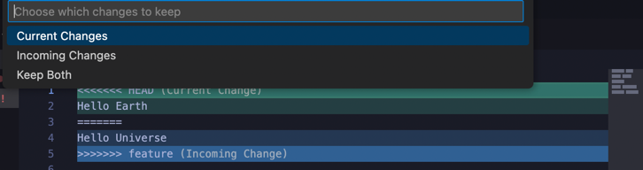
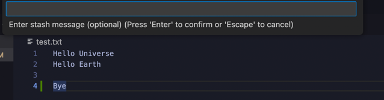

# Git Helper - Your Git Problem Solver 🛠️

Git Helper is a powerful VS Code extension designed to streamline your Git workflow and solve common Git challenges with just a few clicks. No more memorizing complex Git commands or struggling with merge conflicts!

## Features ✨

### 1. Fix Merge Conflicts (`Git Helper: Fix Merge Conflicts`)
- **Interactive Conflict Resolution**: Walk through each conflict with an intuitive interface
- Choose between:
  - Keep your changes
  - Accept incoming changes
  - Keep both versions
- No more manual editing of conflict markers!

### 2. Undo Last Commit (`Git Helper: Undo Last Commit`)
- Safely undo your last commit while preserving changes
- Perfect for when you accidentally commit too early
- Changes remain staged for your next commit

### 3. Smart Stash Management
- **Stash Changes** (`Git Helper: Stash Changes`)
  - Quickly save your work in progress
  - Add custom messages to your stashes
  - Clean workspace when you need to switch tasks
- **Apply Stash** (`Git Helper: Apply Stash`)
  - Visual stash browser
  - See all your stashed changes with their messages
  - Apply any stash with a single click

### 4. Untracked Files Helper (`Git Helper: Fix Untracked Files`)
- See all untracked files in one place
- Multi-select files to track
- No more `git add` commands needed

### 5. Clean Working Directory (`Git Helper: Clean Working Directory`)
- Safely remove all untracked files
- Confirmation dialog prevents accidents
- Perfect for cleaning up your workspace

## Usage 🚀

1. Open the Command Palette (`Ctrl+Shift+P` / `Cmd+Shift+P`)
2. Type "Git Helper" to see all available commands
3. Select the command you need
4. Follow the interactive prompts

## Examples 📝

### Resolving Merge Conflicts

1. Open the conflicted file
2. Run `Git Helper: Fix Merge Conflicts`
3. Choose which changes to keep for each conflict
4. Save and continue with your work

### Managing Stashes

1. Run `Git Helper: Stash Changes`
2. Add a descriptive message (optional)
3. Later, use `Git Helper: Apply Stash` to restore your work

## Requirements 📋

- Visual Studio Code v1.80.0 or higher
- Git installed on your system

## Extension Settings ⚙️

This extension contributes the following commands:

- `githelper.fixMergeConflicts`: Fix merge conflicts in the current file
- `githelper.undoLastCommit`: Undo the last commit
- `githelper.stashChanges`: Stash current changes
- `githelper.applyStash`: Apply a stashed change
- `githelper.fixUntrackedFiles`: Track untracked files
- `githelper.cleanWorkingDirectory`: Clean working directory

## Known Issues 🐛

No known issues at this time. If you find any, please report them on our [GitHub repository](https://github.com/Shellomo/vscode_ext_git-helper).

## Release Notes 📝

### 1.0.0
Initial release of Git Helper:
- Merge conflict resolution
- Stash management
- Untracked files helper
- Clean directory tool
- Undo last commit feature

## Contributing 🤝

We welcome contributions!

## Support 💪

If you find this extension helpful, please consider:
- ⭐ Rating it on the VS Code Marketplace
- 🐛 Reporting issues on GitHub
- 💡 Suggesting new features
- 🔄 Sharing it with your team

## License 📄

This extension is licensed under the MIT License - see the [LICENSE](LICENSE) file for details.

---

**Enjoy coding without Git headaches! 🎉**